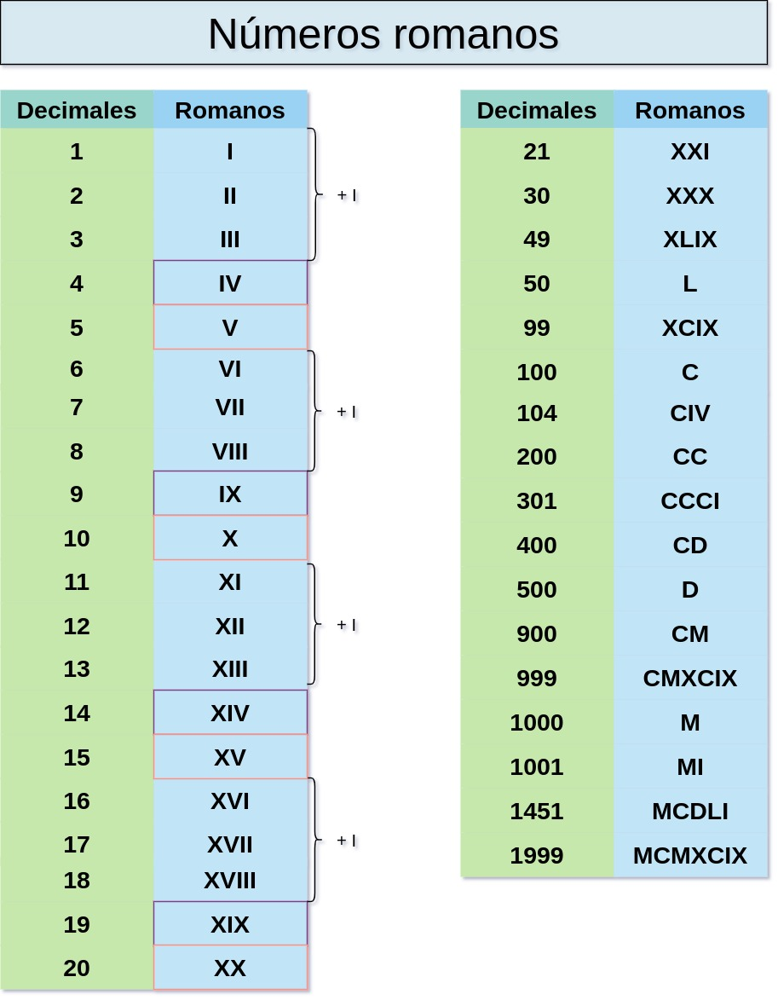

# Task
Write a method `String convert(int)` that takes a number and converts it to the according String representation.
- [ ] You have to convert a decimal number into a roman number as String.

This kata lures a lot of people to implement features in the order of the numbers. But do not forget that it’s sometimes easier to start with a general case and add exceptions later.

# Examples

# Learnings
- [ ] TDD
- [ ] Version control (git)
- [ ] Baby steps

## Authors
Fuen Sansano [@FuenSansano](https://twitter.com/FuenSansano)

### Setup
Luis Rovirosa [@luisrovirosa](https://www.twitter.com/luisrovirosa)

Jordi Anguela [@jordianguela](https://www.twitter.com/jordianguela)